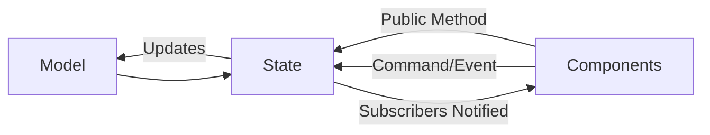
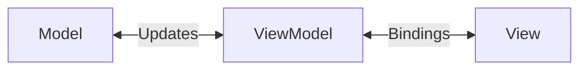
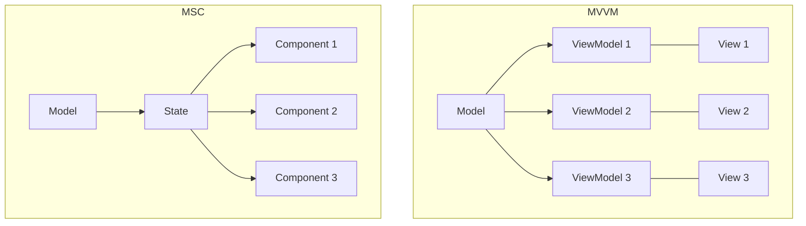

# State Management in Iris

Iris uses a simplified Flux/Redux-inspired architecture called Model State Components (MSC) for state management that maintains unidirectional data flow while reducing boilerplate code.

> MSC originated in Iris, which predates Mythetech.Framework, and was generalized from here into the other Mythetech apps. Older areas of this codebase predate the pattern; new code starts with MSC.

## Core Concepts

### Architecture Overview



The architecture consists of three main parts:
- **Model**: Represents the application data structure, can encapsulate logic
- **State**: Manages data updates, exposes public operations for the model
- **Components**: UI elements that display data and handle user interactions

### Key Principles

1. **Unidirectional Data Flow**
   - Data flows in one direction: Model -> State -> Components
   - Components never directly modify the Model
   - State acts as a barrier between UI and business logic

2. **State as Single Source of Truth**
   - Each domain has a dedicated State class
   - State maintains the current Model
   - Components subscribe to State changes
   - State is registered in the DI container. Iris is a Blazor Hybrid desktop app with a
     single WebView, so the choice is about lifetime rather than hosting model: use
     `AddScoped` for state tied to the active view, and `AddSingleton` for state that must
     outlive navigation (history, saga instances, app-level theme).

3. **Message Bus for Decoupled Communication**
   - The in-memory bus is the default mechanism for decoupling, not a fallback
   - States can subscribe to events that persist even when UI is not active
   - Components will automatically update from State, so values cannot be returned from a Command/Event.
   - It is also how async flows survive a state change. `StateChanged` is an `Action`, so a
     subscriber that needs to await something (JS interop above all) has nothing to await
     into, and the only ways out of a sync handler are `async void` or a dropped `Task`, both
     of which are banned. `IConsumer<T>.Consume()` returns `Task`, so the chain stays awaited
     end to end. Subscribe to `StateChanged` when the reaction is purely a re-render; publish
     a message when the reaction is asynchronous.

4. **State Owns Its Data**
   - Components request changes; the State performs them and notifies subscribers itself
   - Notification is private. A public `Notify`/`NotifyStateChanged` is a smell: it means a
     caller mutated data the State was supposed to own. Add a method to the State instead.

## Implementation

### State Class Example

```csharp
public class State
{
    public string Name { get; private set; }

    public event Action? StateChanged;

    public void Update(string name)
    {
        Name = name;
        NotifyStateChanged();
    }

    private void NotifyStateChanged() => StateChanged?.Invoke();
}
```

### Component Usage Example

```razor
@implements IDisposable

<div>@_state.Name</div>

@code {
    [Inject] private State _state { get; set; } = default!;

    protected override void OnInitialized()
    {
        _state.StateChanged += StateHasChanged;
    }

    public void Dispose()
    {
        _state.StateChanged -= StateHasChanged;
    }
}
```

### Consumer Example

Implement `IConsumer<T>` and the framework registers it through `AddMessageBus()` /
`UseMessageBus()`. Do not subscribe consumers by hand in `Program.cs`.

```csharp
public sealed class AssemblyChangeConsumer : IConsumer<AssemblyLoaded>, IConsumer<AssemblyUnloaded>
{
    private readonly SagaDefinitionState _definitions;

    public AssemblyChangeConsumer(SagaDefinitionState definitions) => _definitions = definitions;

    public Task Consume(AssemblyLoaded message) => _definitions.AddAssemblyAsync(message.Assembly);

    public async Task Consume(AssemblyUnloaded message)
        => await _definitions.RemoveAssemblyAsync(message.FullName);
}
```

A **scoped** State must not implement `IConsumer<T>` itself. Assembly scanning registers
consumer types as root-resolved, so the bus would construct its own instance and update a
copy the UI never sees. Bridge it with a nested subscription class holding a reference to
the State, subscribed on construction and unsubscribed in `Dispose`. A singleton State can
implement `IConsumer<T>` directly.

### Component Size

A large `@code` block is a signal that the component is holding logic the State should own,
not a reason to move it to a `.razor.cs` code-behind. Code-behind relocates the logic without
making it testable; extracting it to a State class does both. Push model data, loading, and
transforms into the State and leave the component with markup, element refs, and UI-only
concerns (dialogs, JS interop, focus).

## Comparison to Other Patterns

### Differences from Flux/NgRx
- No explicit action creators/types
- No reducer functions
- Optional message bus instead of mandatory dispatcher
- C# events/delegates instead of Observable streams
- No built-in undo/redo

### Shared Concepts
- Unidirectional Data Flow
- Actions similar to publishing a Command
- Keeps data fetching at the outer boundary

### Differences from MVVM (Model-View-ViewModel)



1. **Direction of Data Flow**
   - MVVM uses two-way binding between ViewModel and View
   - MSC enforces unidirectional data flow from Component through State to Model
   - MSC's unidirectional flow makes state changes more predictable

2. **Role of the Middle Layer**
   - ViewModel acts as a data transformer/adapter for the View
   - State acts as a business logic container and gatekeeper for Model updates
   - State is more focused on behavior, ViewModel more on data presentation

3. **UI Coupling**
   - ViewModel often contains UI-specific logic and presentation data
   - State is UI-agnostic and could be used with different UI frameworks
   - Components handle all UI-specific concerns

4. **Change Notification**
   - MVVM typically uses property-level change notification (INotifyPropertyChanged)
   - MSC uses coarser-grained state change events
   - MSC's approach reduces boilerplate but may cause more UI refreshes

### Shared Concepts

Both patterns:
- Separate business logic from UI
- Use dependency injection for composition
- Maintain the Model as the core data structure
- Support testability through separation of concerns

### Structural Philosophy

1. **State Sharing vs View Model Isolation**
   - MVVM typically creates dedicated ViewModels for each View
   - ViewModels are usually tightly coupled to their specific Views
   - MSC encourages sharing State across multiple Components
   - State represents a complete feature or domain concern

2. **Granularity and Organization**
   - MVVM organizes by View/ViewModel pairs
   - MSC organizes by feature verticals
   - State classes align with business domains rather than UI structure
   - Fewer classes overall in MSC due to shared state

3. **Data Loading and Model Composition**
   - MVVM often fragments Models to match View-specific needs
   - ViewModels frequently contain data-fetching logic
   - MSC loads complete Model contexts within State
   - Components select needed data from complete Models
   - No performance penalty as data is already in memory



This structural difference reflects MSC's focus on domain-driven design principles, where state boundaries align with business capabilities rather than UI requirements.
